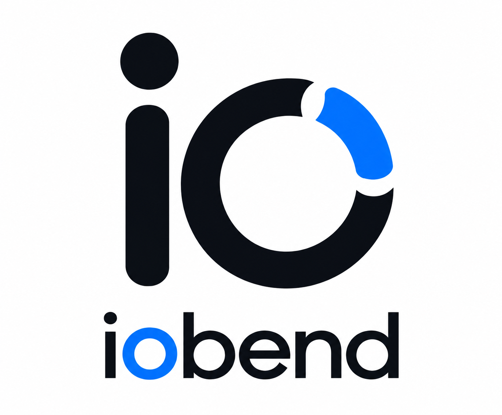

<div align="center">



# Unified Developer Experience Platform & Ecosystem

### Solve. Simplify. Empower. Build.

**IOBend helps developers spend less time fighting their development environment and more time building software.**

<br/>

[](https://www.iobend.com)
[](https://x.com/iobenddev)
[](https://www.linkedin.com/company/iobend/)

<br/>

**For Developers. By Developers.**

</div>

---

# What is IOBend?

**IOBend is a Unified Developer Experience Platform and Ecosystem.**

Modern software development involves much more than writing code.

Developers have to set up machines, configure environments, install
tools, manage dependencies, obtain access, configure projects,
handle secrets, troubleshoot failures, switch between tools, and
solve countless development-environment problems.

IOBend is being built to reduce this friction.

Our goal is simple:

> **Help developers spend more time solving business and engineering problems — and less time solving problems around their development environment.**

---

# What IOBend Does

IOBend focuses on three fundamental goals:

### 01 — Solve Developer Problems

Solve the everyday problems developers encounter while setting up,
joining, building, debugging, maintaining, and working across projects.

### 02 — Improve Developer Productivity

Reduce non-productive engineering work such as repetitive setup,
tool configuration, access issues, environment problems, and
troubleshooting.

### 03 — Let Developers Focus on Building

When unnecessary friction is reduced, developers can focus on:

**Business logic · Product development · Engineering · Innovation**

---

# Platform + Ecosystem

IOBend has two connected ideas:

### Platform

The **IOBend Platform** is the core unified developer experience
across the tools and interfaces developers use.

**Web · CLI · IDE**

### Ecosystem

The **IOBend Ecosystem** extends beyond the core platform through
connected products, integrations, extensions, workflows, templates,
and developer tooling.

```text
                         IOBend
                           │
             Unified Developer Experience
                           │
          ┌────────────────┼────────────────┐
          │                │                │
         Web              CLI              IDE
          │                │                │
          └────────────────┼────────────────┘
                           │
                  Developer Workflows
                           │
        ┌──────────────────┼──────────────────┐
        │                  │                  │
   Environment         Project Hub       Developer
   Management                           Assistance
        │                  │                  │
        └──────────────────┼──────────────────┘
                           │
                    Integrations
                           │
            Tools · Extensions · Workflows
